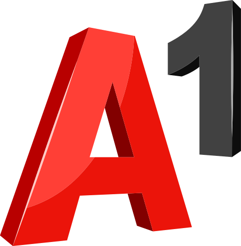
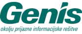

<h2>Rezultati akcije</h2>

Uradni dan digitalnega čiščenja je bil <strong>16. marec 2024</strong>. Na prvo pobudo Ekologov brez meja in o28 komunikacijske skupine se je odzvalo 1288 posameznikov, ki so iz svojih digitalnih naprav izbrisali:

<h3>26 tisoč GB podatkov ≈ 5 ton prihranka izpustov toplogrednih plinov</h3>

Več v <a href="https://ebm.si/prispevki/slovenija-je-ocistila-26-tisoc-gigabajtov">sporočilu Ekologov brez meja</a>. Čistiš in oddaš rezultate pa lahko še naprej - tvoji rezultati bodo prišteti k rezultatom akcije 2025.

  


## O akciji v medijih
- <a href="https://365.rtvslo.si/arhiv/dobro-jutro/175023261" target="_blank" rel="noopener">TV Slovenija: Dobro jutro, 15. februar 2024</a>
- <a href="https://365.rtvslo.si/arhiv/think-green/175024246" target="_blank" rel="noopener">Radio Si: Think Green, 19. februar 2024</a>
- <a href="https://www.slovenskenovice.si/ona/stil/najlazja-cistilna-akcija-na-svetu/" target="_blank" rel="noopener">Revija Ona, 21. februar 2024</a>
- <a href="https://www.facebook.com/vtvstudioslo/videos/367107139471610/" target="_blank" rel="noopener">VTV Studio, 22. februar 2024</a>
- <a href="https://n1info.si/novice/slovenija/najlazja-cistilna-akcija-na-svetu-tudi-digitalni-odpadki-skodujejo-okolju/" target="_blank" rel="noopener">N1, 27. februar 2024</a>
- <a href="https://365.rtvslo.si/arhiv/radio-koper-svetuje/175026624" target="_blank" rel="noopener">Radio Koper, 29. marec 2024</a>
- <a href="https://www.metropolitan.si/novice/odklikajmo-digitalne-odpadke-izkoristimo-dodatni-dan-v-letu-za-digitalno-cistilno-akcijo/" target="_blank" rel="noopener">Metropolitan, 1. marec 2024</a>
- <a href="https://www.caszazemljo.si/trajnostno/ste-kdaj-ocistili-digitalno-nesnago.html" target="_blank" rel="noopener">Čas za Zemljo, 6. marec 2024</a>
- <a href="https://www.delo.si/novice/znanoteh/pomladansko-ciscenje-digitalnega-smetja" target="_blank" rel="noopener">Delo, 10. marec 2024</a>
- <a href="https://www.rtvslo.si/okolje/ocistimo-slovenijo-digitalnih-odpadkov-iz-digitalnih-naprav-izbrisano-26-000-gigabajtov-podatkov/701774" target="_blank" rel="noopener">MMC, 16. marec 2024</a>

	<h2>Podporniki akcije 2024</h2>
	<h3>Giga</h3>
	

		
		
	

	<h3 style="margin: 2rem 0">Mega</h3>
	

		

			
		

			
		

			
		

			
		

			
		

			
		

	

	<h3 style="margin: 3rem 0 1.5rem">Akcijo so podprli tudi</h3>
	

		
		
	

