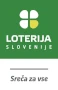

blablabla

	<h2>Podporniki akcije</h2>
	<h3>Giga</h3>
	

		
		
	

	<h3 style="margin: 2rem 0">Mega</h3>
	

		

			
		

			
		

			
		

			
		

			
		

			
		

	

	<h3 style="margin: 3rem 0 1.5rem">Akcijo podpirajo tudi</h3>
	

		
		
	

