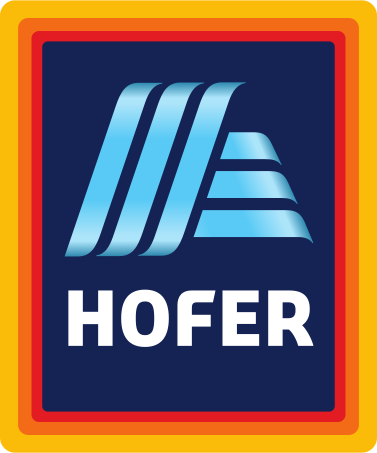

<h2>Rezultati akcije 2025</h2>

Uradni dan digitalnega čiščenja je bil <strong>15. marec 2025</strong>, akcija pa je potekala do 31. marca. Na pobudo Ekologov brez meja in o28 komunikacijske skupine se je odzvalo 9471 posameznikov, ki so iz svojih digitalnih naprav izbrisali:

<h3>25 tisoč GB podatkov ≈ 5 ton prihranka izpustov toplogrednih plinov</h3>

Več v <a href="https://ebm.si/prispevki/slovenija-ocistila-23-terabajtov-digitalnih-odpadkov">sporočilu Ekologov brez meja</a>. Čistiš in oddaš rezultate pa lahko še naprej - tvoji rezultati bodo prišteti k rezultatom akcije 2026.

  


## O akciji v medijih
- [Eko dežela, 7. februar 2025](https://www.ekodezela.si/eko-aktualno/digitalni-odpadki-80-podatkov-ki-jih-hranimo-nikoli-vec-ne-uporabimo/)
- [RTV Slovenija, Omizje, 12. februar 2025](https://365.rtvslo.si/arhiv/omizje/175108852)
- [RTV Slovenija, 15. marec 2025](https://www.rtvslo.si/znanost-in-tehnologija/digitalne-smeti-so-problem-internet-ima-vedno-vecji-ogljicni-odtis/739537)
- [Čas za zemljo, 15. marec 2025](https://www.caszazemljo.si/trajnostno/trajnostni-digitalni-razvoj-80-podatkov-ki-jih-hranimo-kot-clovestvo-nikoli-vec-ne-uporabimo.html)
- [RTV Slovenija, Izluščeno, 17. marec 2025](https://radiosi.rtvslo.si/podcast/izlusceno/173250930/175117248)
- [Dnevnik, 2. april 2025](https://www.dnevnik.si/novice/slovenija/skodljive-izpuste-povzrocajo-tudi-shranjeni-podatki-ki-jih-ne-potrebujete-vec-2725265/)
- [N1, 2. april 2025](https://n1info.si/novice/slovenija/digitalna-higiena-9-471-ljudi-v-akciji-odstranilo-23-000-gigabajtov-podatkov/)
- [STA, 2. april 2025](https://www.sta.si/3411549/slovenija-ocistila-23-terabajtov-digitalnih-odpadkov)

	<h2>Podporniki akcije 2025</h2>
	<h3 style="margin: 2rem 0">Mega</h3>
	

		

			
		

		

			
		

	

	<h3 style="margin: 2rem 0">Kilo</h3>
	

		

			
		

		

			
		

	

	<h3 style="margin: 3rem 0 1.75rem">Akcijo so podprli tudi</h3>
	

		
		
		
		
		
	

