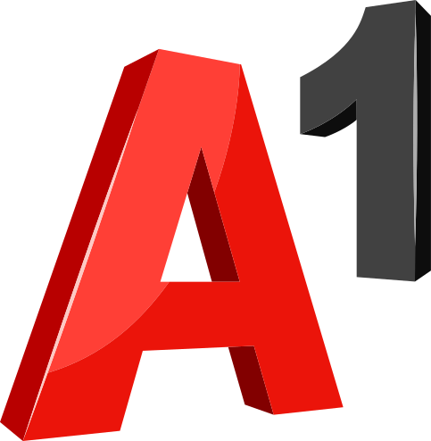
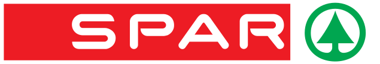

<h2>Rezultati akcije 2026</h2>

Uradni dan digitalnega čiščenja je bil <strong>14. marec 2026</strong>, akcija pa je potekala do 31. marca. Na pobudo Ekologov brez meja in o28 komunikacijske skupine se je odzvalo 3640 posameznikov, ki so iz svojih digitalnih naprav izbrisali:

<h3>185 tisoč GB podatkov ≈ 38 ton prihranka izpustov toplogrednih plinov</h3>

Več v <a href="https://ebm.si/prispevki/zakljucek-akcije-ocistimo-slovenijo-digitalnih-odpadkov-v-treh-letih-izbrisanih-234000-gb">sporočilu Ekologov brez meja</a>. Čistiš in oddaš rezultate pa lahko še naprej!

  


## O akciji v medijih
- [STA, 11. februar 2026](https://krog.sta.si/3521081/na-konferenci-o-okoljskih-vplivih-digitalnih-tehnologij)
- [RTVSLO, Podkast Aktualna tema, 23. februar 2026](https://365.rtvslo.si/arhiv/aktualna-tema/175200941)
- [Dnevne novice, 17. marec 2026](https://dnevne-novice.com/poteka-ze-tretje-ciscenje-slovenskih-digitalnih-odpadkov/)
- [Marketing Magazin, 22. marec 2026](https://www.marketingmagazin.si/aktualno/novice/7246/mm-hitrice/novice)
- [SI21, 8. april 2026](https://www.si21.com/IT/v-treh-letih-izbrisanih-234.000-gb-podatkov/)

	<h2>Podporniki akcije 2026</h2>
	<h3 style="margin: 2rem 0">Kilo</h3>
	

		

			
		

		

			
		

		

			
		

	

