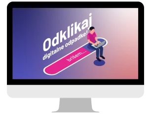
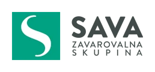
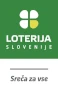
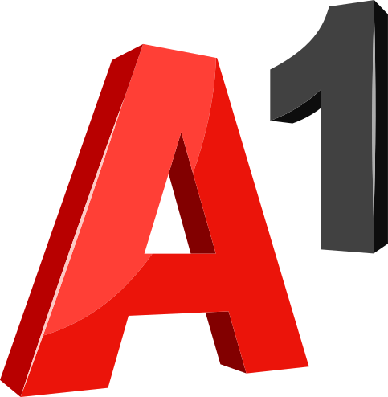
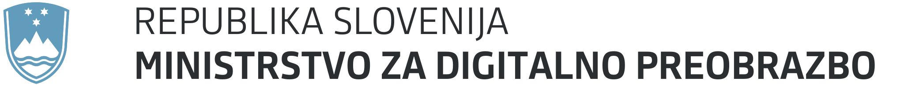

	

		
	

	

		<h2 style="color:white">Internet proizvede več emisij kot letalstvo!</h2>
		

			Dobrodošel/a v digitalni različici akcije Očistimo Slovenijo, kjer bomo skupaj ustvarjali trajnostno digitalno prihodnost. Stopi korak naprej, očisti svoje digitalne naprave, zmanjšaj ogljični odtis in skupaj z nami oblikuj bolj trajnosten digitalni svet!
		

	

<h2>Kako sodeluješ?</h2>

Uradni dan digitalnega čiščenja je <strong>16. marec 2024</strong>. Ker pa se spremembe ne dogajajo čez noč, lahko z nami čistiš in <a href="https://digital.ocistimo.si/zabelezi-rezultate.html">oddaš rezultate</a> vse od februarja naprej. Vsi do roka (16. marec do 16. ure) oddani podatki bodo upoštevani v letošnjem poročilu akcije.

  
Še pred tem pa te vabimo k izpolnjevanju <a href="https://1ka.arnes.si/a/3bb67f93" target="_blank" rel="noopener">kratkega in preprostega vprašalnika</a>, ki nam bo povedal, kako domača tema so digitalni odpadki med Slovenkami in Slovenci. 



<h2>Cilji akcije</h2>

	

		
	

	

		<h3>Odstraniti čim več odvečnih podatkov</h3>
		Do zaključka akcije 16. marca 2024 <strong>počistiti čim več odvečnih gigabajtov</strong> in okolje <a href="https://digital.ocistimo.si/o-akciji.html">razbremeniti digitalnih odpadkov</a>. Z enostavnim ukrepom lahko zmanjšaš emisije CO2 ter podaljšaš življenjsko dobo elektronske opreme.
	

	

		
	

	

		<h3>Dvigniti ozaveščenost</h3>
		Poskrbeti za nacionalno <strong>ozaveščenost</strong> o trajnostnem življenju <strong>s poudarkom na digitalnih odpadkih</strong>.
	

	

		
	

	

		<h3>Preprečiti kopičenje digitalnih odpadkov</h3>
		Posameznike opolnomočiti, da bodo lahko <strong>preprečili kopičenje digitalnih odpadkov</strong>.
	

	

		
	

	

		<h3>Navdihniti Slovence</h3>
		<strong>Navdihniti Slovence</strong>, da svoje skrbno ravnanje do okolja prenesejo v digitalni svet, za to navdušijo svoje družine, prijatelje, znance, poslovne partnerje in druge, ki jih obkrožajo ter s svojim zgledom navdihujejo vse generacije, ki jim sledijo!
	

	<h2>Podporniki akcije</h2>
	<h3>Giga</h3>
	

		
		
	

	<h3 style="margin: 2rem 0">Mega</h3>
	

		
		
		
		
		
		
	

	<h3 style="margin: 3rem 0 1.5rem">Akcijo podpira tudi</h3>
	

		
	

