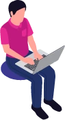

	

		
	

	

		<h2 style="color:white">Internet proizvede več emisij kot letalstvo!</h2>
		

			Dobrodošli v digitalni različici akcije Očistimo Slovenijo, kjer bomo skupaj ustvarjali trajnostno digitalno prihodnost. Stopite korak naprej, očistite svoje digitalne naprave, zmanjšajte ogljični odtis in skupaj z nami oblikujte bolj trajnosten digitalni svet!
		

	

## Kako sodeluješ?

Uradni dan digitalnega čiščenja bo <strong>16. marec 2024</strong>! Ker pa se spremembe ne dogajajo čez noč, lahko z nami čistite že od februarja naprej.



## Cilji akcije

### Odstraniti čim več odvečnih podatkov
Do zaključka akcije 16. marca 2024 **počistiti čim več odvečnih gigabajtov** in okolje razbremeniti digitalnih odpadkov.

### Dvigniti ozaveščenost
Poskrbeti za nacionalno **ozaveščenost** o trajnostnem življenju **s poudarkom na digitalnih odpadkih**.

### Preprečili kopičenje digitalnih odpadkov
Posameznike opolnomočiti, da bodo lahko **preprečili kopičenje digitalnih odpadkov**.

### Navdihniti Slovence
**Navdihniti Slovence**, da svoje skrbno ravnanje do okolja prenesejo iz fizičnega v digitalni svet, za to navdušijo svoje družine, prijatelje, znance, poslovne partnerje in druge, ki jih obkrožajo ter s svojim zgledom navdihujejo vse generacije, ki jim sledijo!

## Podporniki projekta

/skupek logotipov/

