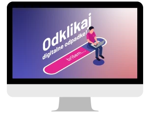
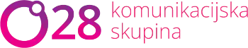
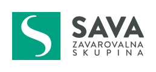
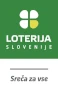
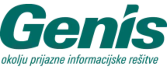
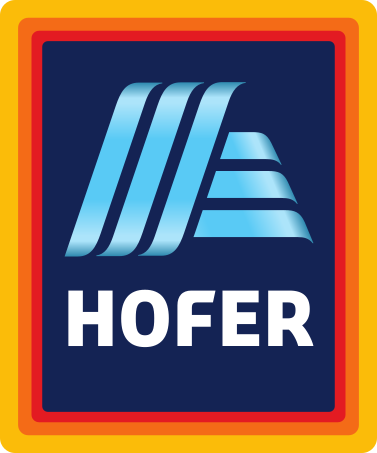
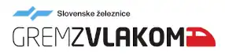
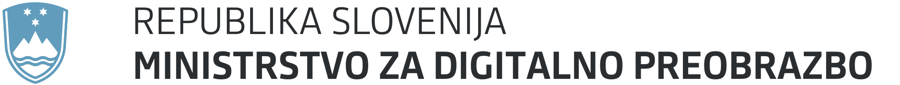
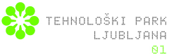
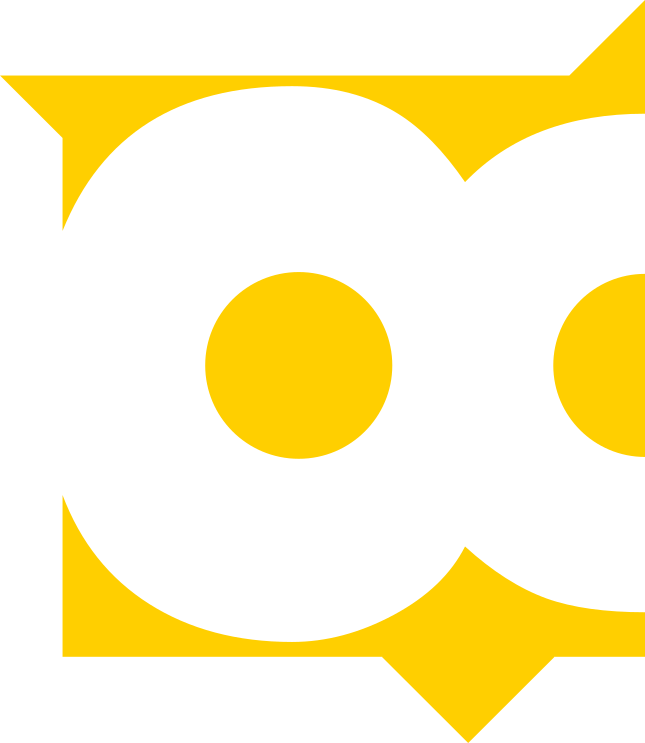

	

		
	

	

		<h2 style="color:white">Internet proizvede več emisij kot letalstvo!</h2>
		

			Dobrodošel/a v digitalni različici akcije Očistimo Slovenijo, kjer bomo skupaj ustvarjali trajnostno digitalno prihodnost. Stopi korak naprej, očisti svoje digitalne naprave, zmanjšaj ogljični odtis in skupaj z nami oblikuj bolj trajnosten digitalni svet!
		

	

<h2>Akcije je konec, čiščenja pa ne!</h2>

Projekt <strong>Očistimo Slovenijo digitalnih odpadkov</strong> je v treh letih povezal več tisoč posameznikov, podjetij, šol in organizacij ter pokazal, da lahko že z majhnimi koraki zmanjšamo svoj digitalni odtis.

Skupaj smo izbrisali 234 tisoč GB podatkov ≈ 49 ton prihranka izpustov toplogrednih plinov na leto!

Čeprav se je organizirana vseslovenska akcija zaključila, digitalno čiščenje ostaja enostaven način, kako prispevati k bolj trajnostni uporabi tehnologije.

<strong>Začni kadarkoli. Vsak izbris šteje.</strong>



	<h2>Pobudniki akcije</h2>
	

		
		
	

	<h2>Podporniki akcije</h2>
	<h3>Giga</h3>
	

		
		
	

	<h3 style="margin: 3rem 0">Mega</h3>
	

		

			
		

			
		

			
		

			
		

			
		

			
		

		

			
		

	

	<h3 style="margin: 3rem 0 2rem">Kilo</h3>
	

		

			
		

		

			
		

		

			
		

		

			
		

		

			
		

		

			
		

	

	<h3 style="margin: 3rem 0 2rem">Akcijo so podprli tudi</h3>
	

		
		
		
		
		
		
	

