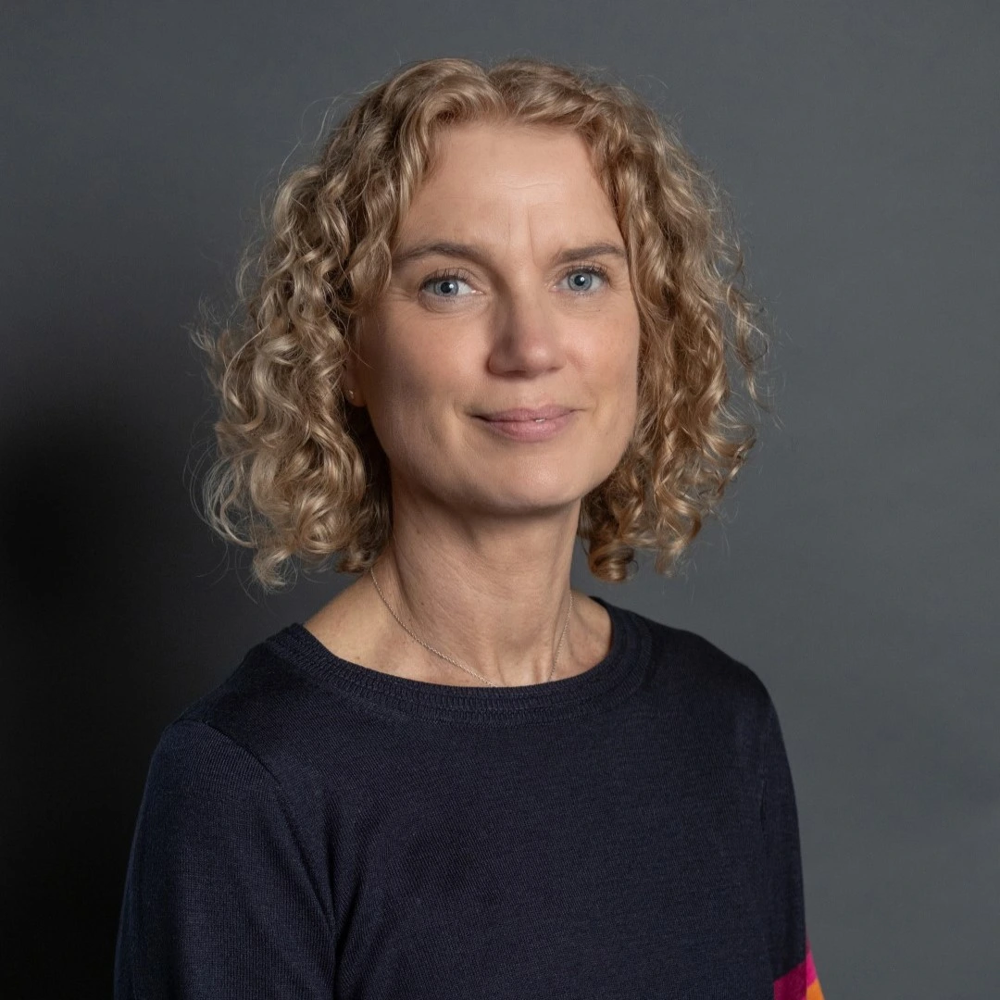
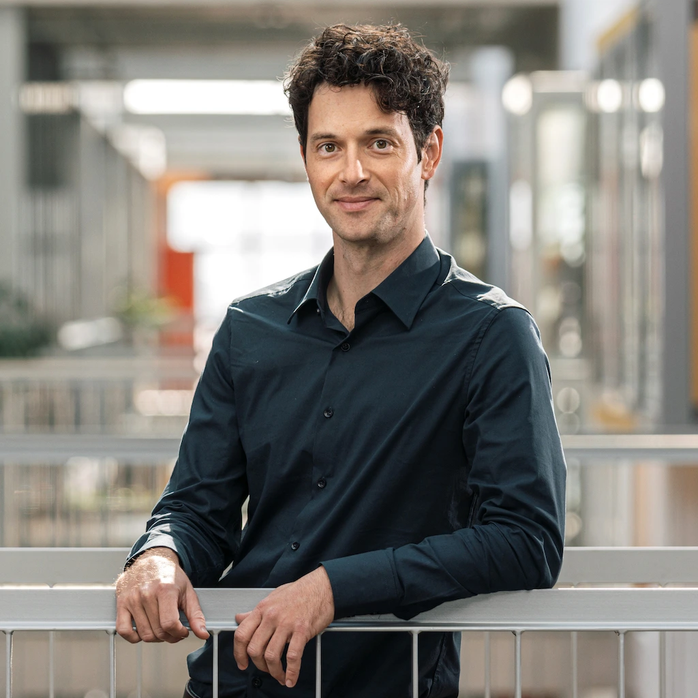
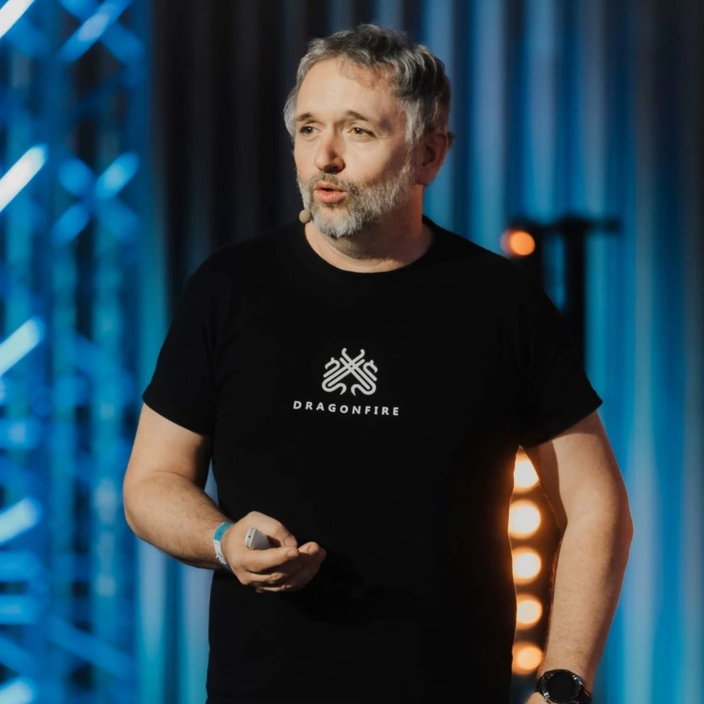
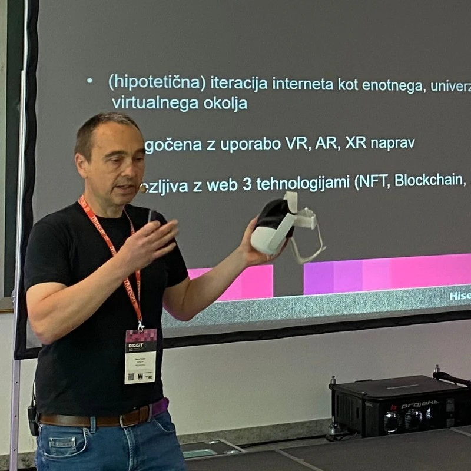
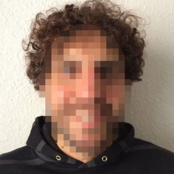
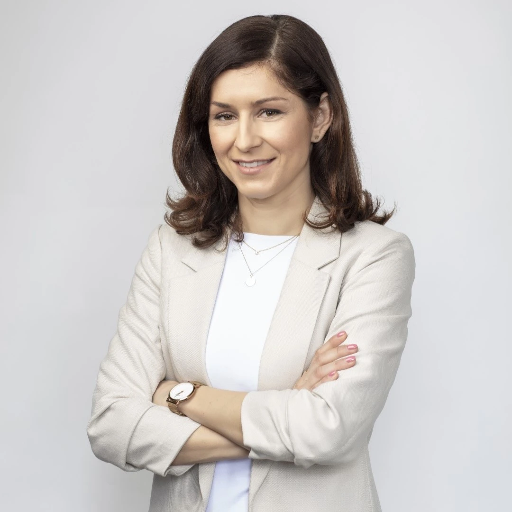
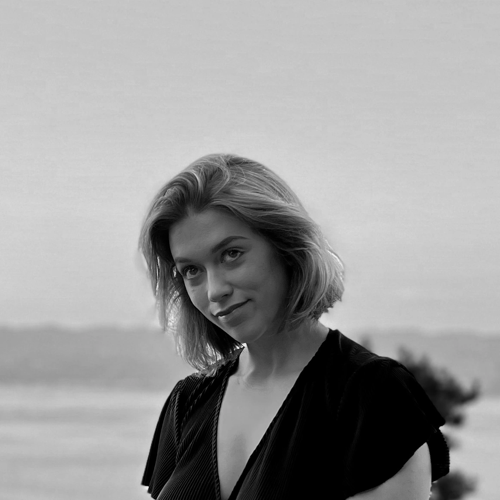
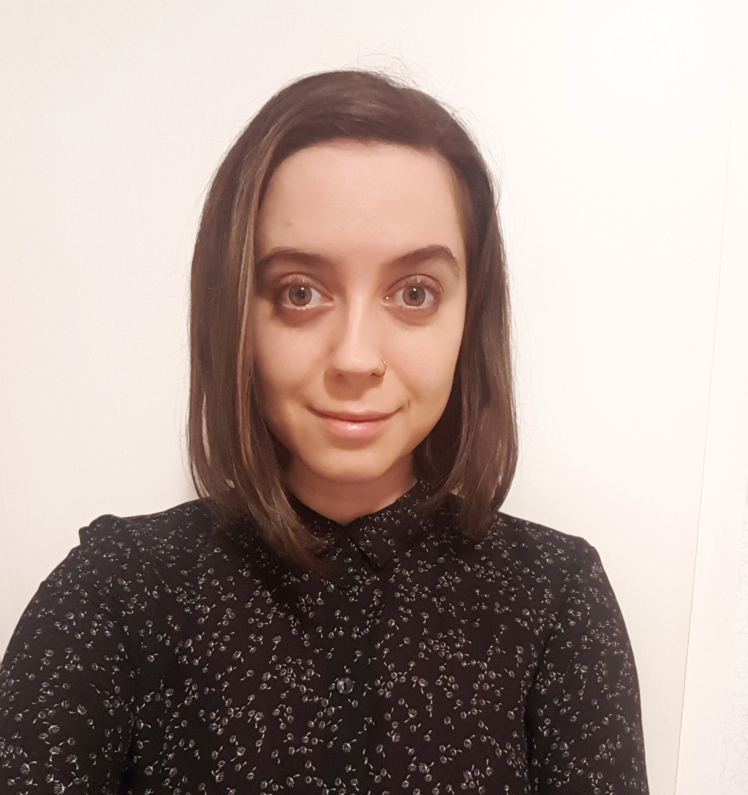

Strokovna konferenca, namenjena predstavnikom podjetij, fakultet, medijev in splošni javnosti, je potekala v <strong>torek, 4. februarja, med 9.00 in 13.00 v Tehnološkem parku Ljubljana.</strong>

Oglejte si posnetke predavanj tujih gostov:

	
	
	
	

### Program strokovne konference

<table id="program-konfe" style="text-align: center">
  <tbody>
    <tr>
      <th>Ura</th>
      <th>Prispevek</th>
      <th>Sodelujoči</th>
    </tr>
    <tr>
      <td>8.30 - 9.00</td>
      <td>Registracija</td>
      <td></td>
    </tr>
    <tr>
      <td>9.00</td>
      <td>Pozdravni nagovor</td>
      <td>Tina Cipot, o28</td>
    </tr>
    <tr>
      <td>9.00 - 9.30</td>
      <td>Building digital solutions for the Anthropocene: avoiding digital wastefulness*</td>
      <td><a href="https://www.lancaster.ac.uk/energy-lancaster/about-us/people/adrian-friday">Adrian Friday</a>, profesor računalništva in trajnosti na univerzi Lancaster</td>
    </tr>
    <tr>
      <td>9.30 - 10.00</td>
      <td>Unveiling the Hidden Costs: The Environmental Impact of Digitalization on the Road to Net-Zero Emissions*</td>
      <td><a href="https://www.lboro.ac.uk/schools/business-school/our-people/kate-broadhurst/">dr. Kate Broadhurst</a>, predavateljica za inovacije in strategijo ter članica skupine za digitalno razogličenje </td>
    </tr>
    <tr>
      <td>10.00 - 10.45</td>
      <td>Okrogla miza: Izzivi in priložnosti (ne)učinkovitosti v IKT</td>
      <td style="text-align:left">
        <ul>
          <li>izr. prof. dr. Veljko Pejović, Fakulteta za računalništvo in informatiko UL</li>
          <li>Aleš Pevc, Tehnološki park</li>
          <li>Borut Sočan, Reeba XR</li>
        </ul>
        Moderira: Jaka Kranjc, Ekologi brez meja
      </td>
    </tr>
    <tr>
      <td>10.45 - 11.00</td>
      <td>Odmor za kavo</td>
      <td></td>
    </tr>
     <tr>
       <td>11.10 - 11.20</td>
       <td>Kako je globalna digitalna čistilna akcija povezala 1,1 milijona ljudi?*</td>
       <td>Anett Linno, članica upravnega odbora Let’s do it!</td>
     </tr> 
    <tr>
        <td>11.20 - 11.40</td>
        <td>The Opt Green campaign and the power of FOSS to prevent waste*</td>
        <td>Joseph P. De Veaugh-Geiss, KDE Eco Project & Community Manager</td>
      </tr>
      <tr>
        <td>11.40 - 12.40</td>
          <td>Predstavitev dobrih praks</td>
          <td style="text-align:left">
        <ul>
          <li>Maja Kalan, Ljubljanske mlekarne, vodja korporativnega komuniciranja in družbene odgovornosti</li>
          <li>Ana Boršić, A1, ekspert za korporativno komuniciranje</li>
          <li>Tanja Teršar, GEN-I</li>
        </ul>
          </td>
      </tr>
          <tr>
            <td>13.00</td>
            <td>Zaključek</td>
            <td></td>
          </tr>
        
   
      
  </tbody>
</table>
*Predavanje bo potekalo preko platforme Zoom in bo v angleščini. 

### Sodelujoči

  

    
    

      
dr. Adrian Friday

      
Profesor računalništva in trajnosti na Univerzi Lancaster

    

  

  

    
    

      
dr. Kate Broadhurst

      
Predavateljica za inovacije in strategijo ter članica skupine za digitalno razogličenje

    

  

  

    
    

      
izr. prof. dr. Veljko Pejović

      
Fakulteta za računalništvo in informatiko UL

    

  

  

    
    

      
Aleš Pevc

      
Tehnološki park

    

  

  

    
    

      
Borut Sočan

      
ReebaXR

    

  

  

    
    

      
Anett Linno

      
Članica uprave Let’s do it World!

    

  

  

    
    

      
Joseph P. De Veaugh-Geiss

      
KDE Eco Project & Community Manager

    

  

    

    
    

      
Maja Kalan

      
Ljubljanske mlekarne

    

  

    

    
    

      
Ana Boršić

      
A1

    

  

    

    
    

      
Tanja Teršar

      
GEN-I

    

  

  

    
    

      
Tina Cipot

      
o28

    

  

  

    
    

      
Jaka Kranjc

      
Ekologi brez meja

    

  

### Podporniki

Konferenco podpirajo:

  

		
	

  

		
	

