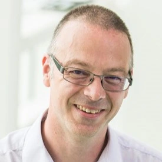
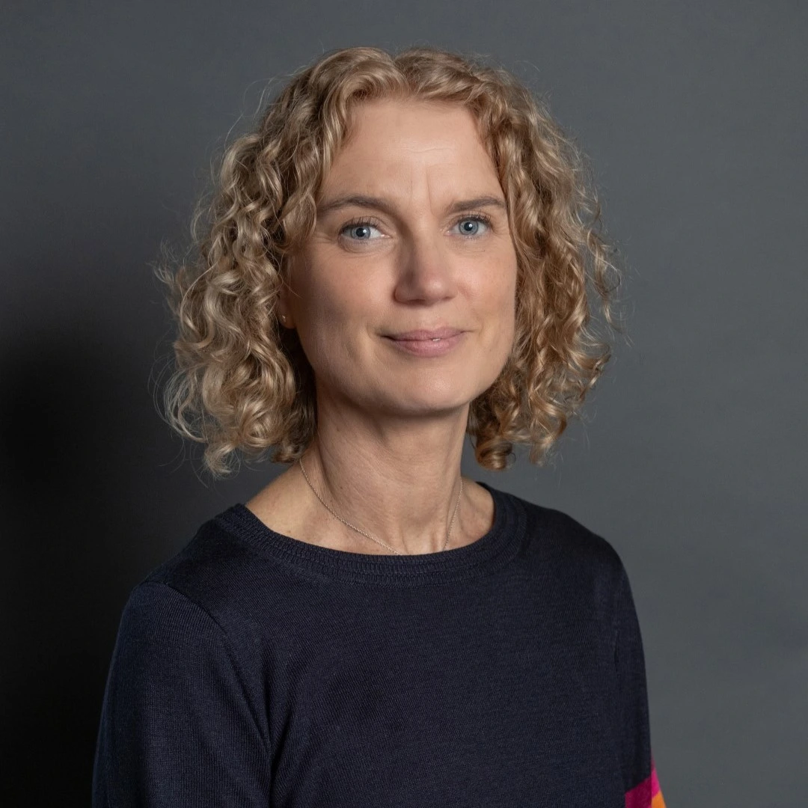
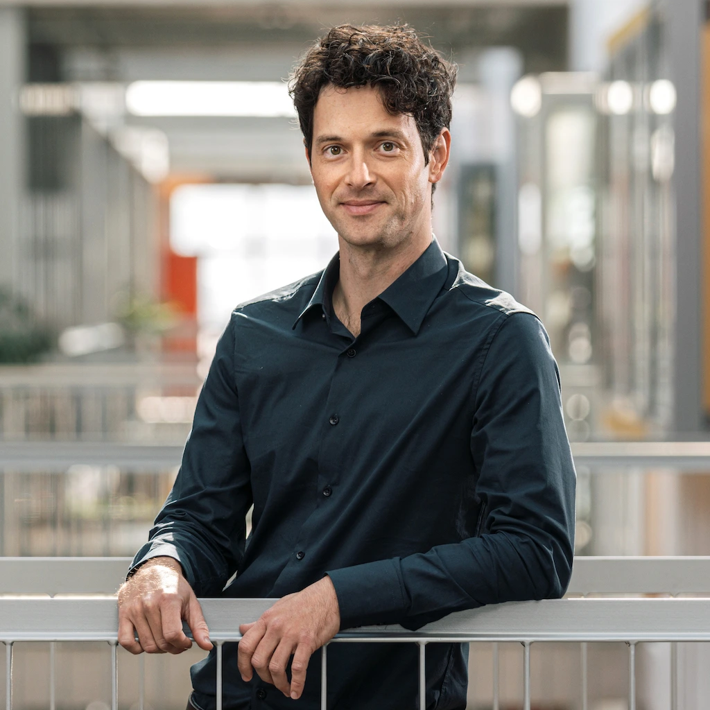
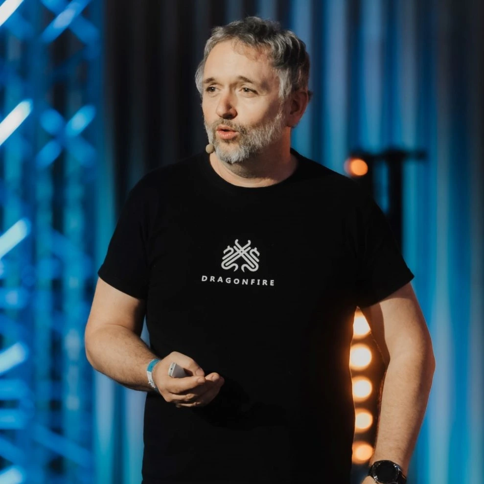
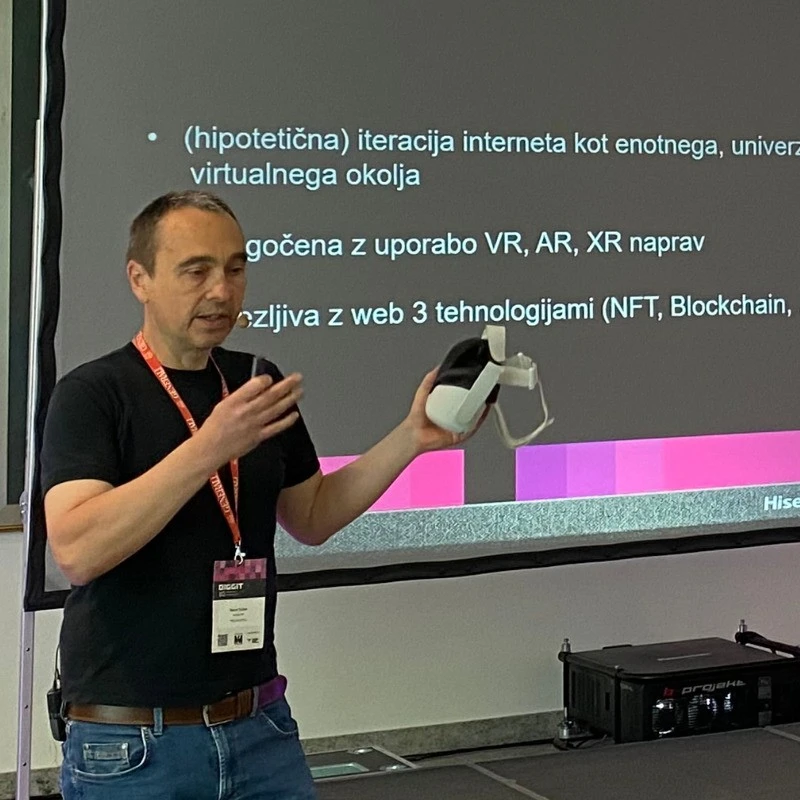
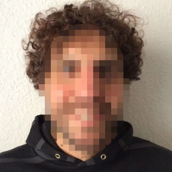
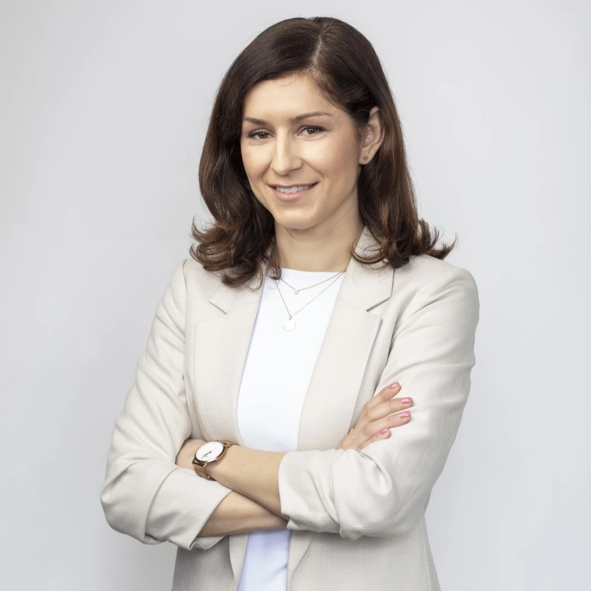
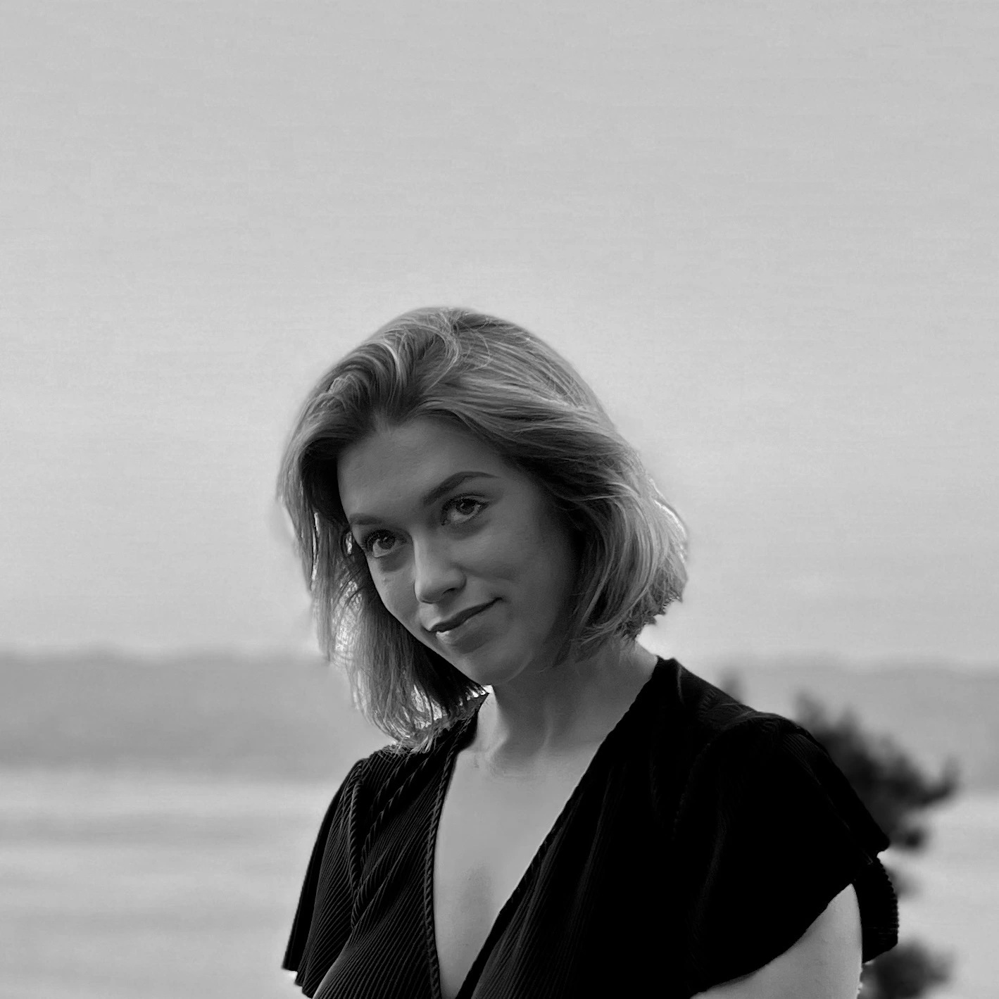
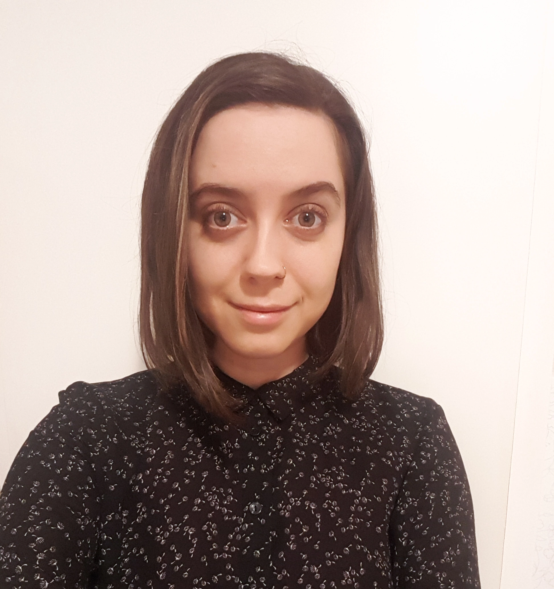

Strokovna konferenca, namenjena predstavnikom podjetij, fakultet, medijev in splošni javnosti, bo potekala v <strong>sredo, 11. februarja, med 9.00 in 14.30 v Računalniškem muzeju v Ljubljani.</strong>

<!--
Oglejte si posnetke predavanj tujih gostov:

	
	
	
	

-->

### Program strokovne konference

<table id="program-konfe" style="text-align: center">
  <tbody>
    <tr>
      <th>Ura</th>
      <th>Prispevek</th>
      <th>Sodelujoči</th>
    </tr>
    <tr>
      <td>9.30 - 10.00</td>
      <td>Registracija</td>
      <td></td>
    </tr>
    <tr>
      <td>10.00</td>
      <td>Uvodni pozdrav</td>
      <td></td>
    </tr>
    <tr>
      <td>10.05 - 10.25</td>
      <td><i>Podatkovni centri kot pospeševalci nastajanja e-odpadkov</i></td>
      <td>izr. prof. dr. Mojca Ciglarič, dekanja UL FRI in nosilka predmeta Trajnostni vidiki računalništva</td>
    </tr>
    <tr>
      <td>10.25 - 10.45</td>
      <td>Digital sufficiency (digitalna zadostnost)*</td>
      <td>prof. Geoffrey Aerts FARI Academic Director - Vrije Universiteit Brussel (VUB)</td>
    </tr>
    <tr>
      <td>10.45 - 11.05</td>
      <td><i>Prekomerna digitalizacija kot gonilo nastajanja e-odpadkov</a>*</td>
      <td>Izr. prof. dr. Urban Sedlar, UL FE</td>
    </tr>
    <tr>
      <td>11.05 - 11.25</td>
      <td><i>Prekomerna digitalizacija — skozi oči varstva potrošnikov</a>*</td>
      <td>Boštjan Okorn, Zveza potrošnikov Slovenije</td>
    </tr>
    <tr>
      <td>11.25 - 11.40</td>
      <td>Odmor za kavo</td>
      <td></td>
    </tr>
    <tr>
      <td>11.40 - 12.00</td>
      <td>Okoljska zasnova programske opreme (software ecodesign)</td>
      <td>Jaka Kranjc, Ekologi brez meja</td>
    </tr>
    <tr>
      <td>12.00 - 12.20</td>
      <td><i>Strojne omejitve kot gonilo boljše programske opreme skozi čas</i></td>
      <td>Računalniški muzej</td>
    </tr>
    <tr>
      <td>12.20 - 12.40</td>
      <td><i>Pregled aktivnosti in uspehov kampanje EndOf10</i></td>
      <td>Lio Novelli, Kompot</td>
    </tr>
    <tr>
      <td>12.40 - 13.00</td>
      <td>Odprta debata</td>
      <td></td>
    </tr>
    <tr>
      <td>13.00</td>
      <td>Zaključek konferenčnega dela</td>
      <td></td>
    </tr>
    <tr>
      <td colspan="3"></td>
    </tr>
    <tr>
      <td>13.15 - 14.30</td>
      <td>Delavnica: digitalni čistilni servis z ambasadorji Evropskega podnebnega pakta</td>
      <td></td>
    </tr>
  </tbody>
</table>
*Predavanje bo potekalo preko spleta. 

<!--
### Sodelujoči

  

    
    

      
dr. Adrian Friday

      
Profesor računalništva in trajnosti na Univerzi Lancaster

    

  

  

    
    

      
dr. Kate Broadhurst

      
Predavateljica za inovacije in strategijo ter članica skupine za digitalno razogličenje

    

  

  

    
    

      
izr. prof. dr. Veljko Pejović

      
Fakulteta za računalništvo in informatiko UL

    

  

  

    
    

      
Aleš Pevc

      
Tehnološki park

    

  

  

    
    

      
Borut Sočan

      
ReebaXR

    

  

  

    
    

      
Anett Linno

      
Članica uprave Let’s do it World!

    

  

  

    
    

      
Joseph P. De Veaugh-Geiss

      
KDE Eco Project & Community Manager

    

  

    

    
    

      
Maja Kalan

      
Ljubljanske mlekarne

    

  

    

    
    

      
Ana Boršić

      
A1

    

  

    

    
    

      
Tanja Teršar

      
GEN-I

    

  

  

    
    

      
Tina Cipot

      
o28

    

  

  

    
    

      
Jaka Kranjc

      
Ekologi brez meja

    

  

-->

### Podporniki

Konferenco podpirajo:

  

		
	

<!--  

		
	
-->

