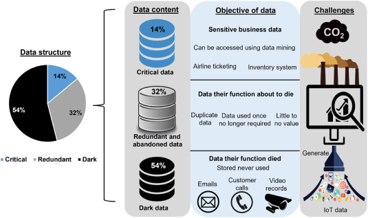

## {{ page.title }}

[Digitalni odtis](o-akciji.html) je kompleksna količina, ki jo lahko le ocenimo. Za spletne strani je to lažje,
saj obstajajo [uveljavljene metodologije](https://developers.thegreenwebfoundation.org/co2js/explainer/methodologies-for-calculating-website-carbon/#carbon-estimation-models)
in spletni testi.

Med njimi je najbolj znan [Website Carbon Calculator](https://www.websitecarbon.com/), ki ga pri razvoju uporabljamo tudi Ekologi brez meja. Upošteva energetsko intenzivnost podatkov, državo, vrsto vira energije v napravi in strežnikih. Ključni podatek pa je najbolj enostaven: **velikost (teža) spletne strani** — iz koliko podatkov je sestavljena?

Na srečo velikost strani bistveno vpliva tudi na hitrost nalaganja in na uporabniško izkušnjo, kar povzroča krajše brskanje, manj povratkov in [nižjo prodajo](https://www.websitebuilderexpert.com/building-websites/website-load-time-statistics/). Amazon je na primer ocenil, da bi sekundo daljše nalaganje za njih povzročilo letno izgubo v višini 1,6 milijarde dolarjev. Iz teh razlogov je na voljo več orodij za diagnostiko hitrosti nalaganja in izrisovanja spletnih strani, ki so uporabne tudi za zmanjševanje digitalnega odtisa.

Prijemov za zmanjšanje je več, v osnovi pa se moramo vprašati, kateri vsi elementi so nujno potrebni, v kakšni obliki in velikosti so ter kateri morajo biti naloženi takoj.
Tipične napake:
- **Prevelike in slabo stisnjene slike**, npr. v velikosti 900x300 pikslov, pri tem da bo na strani vedno prikazana v velikosti 300x100 (9x manjši). Uporaba modernih in vektorskih formatov lahko velikost še zmanjša.
- **Videi**, ki začnejo avtomatsko igrati ob prikazu strani lahko porabijo ogromno podatkov; že sam Youtoubov predvajalnik je vreden slabi megabajt, skoraj polovico povprečne velikosti spletnih strani v letu 2022. Način, kako se jih vgrajuje v spletne strani pomeni, da ta se ta strošek ponovi z vsakim dodatnim videom.
- Uporaba **neoptimizirane kode in ogrodij**. Večina spletnih strani v ozadju vsebuje precej balasta za redke vrste sistemov, redko obiskane podstrani, redke grafične elemente in redke interakcije. Ko ti deli niso naloženi po potrebi, le višajo odtis strani.
- **Oglasi** tretjih strani upočasnujejo nalaganje in omogočajo sledenje uporabnikom pogosto tudi med brskanjem po drugih straneh.

  

		
		
Vektorske slike zavzamejo enako količino prostora na disku ne glede na dimenzije

	

Nižji digitalni odtis spletne strani ne pomeni nujno odrekanja lepoti in funkcionalnosti. Podobno kot spletna varnost obstaja na spektru, kjer so na eni strani peresno lahke dvobarvne strani, na drugi pa pošasti, ki samo za drobno [ikono za brskalnik porabijo več megabajtov](https://iconmap.io/blog#speed-file-size--resolution). Vmes je polje, kjer se sprašujemo kakšno vrsto tehnologije uporabljati, koliko se nam mudi in ali sploh poznamo gradnike, s katerimi delamo. Velikost spletnih strani namreč [še kar raste](https://almanac.httparchive.org/en/2022/page-weight#request-bytes).

Skozi čas postaja zavedanje in delo na nižanju odtisa lažje. Brskalniki se vedno bolj strinjajo glede funkcionalnosti, na voljo je vedno več namenskih orodij in nastajajo celo formalne [smernice za trajnostne strani](https://w3c.github.io/sustyweb/). Hkrati se še vedno viša zapletenost osnovnih tehnologij in ni redko, da spletne strani porabijo na stotine megabajtov pomnilnika (in več) za delovanje, kar zlahka upočasni celoten računalnik. Glede na primerjalno enostavnost spletnih strani in aplikacij napram navadnim namiznim, je to skoraj nerazumljivo. Pod črto ostaja še veliko dela na optimizaciji po celotni programski (in strojni!) vrednostni verigi.

## Kako se obnesejo najbolj popularne slovenske strani?

V spodnji razpredelnici prikazujemo digitalni odtis nekaj najpogosteje obiskanih spletnih strani v Sloveniji. Najboljših podatkov za to nimamo, saj pri [SimilarWeb](https://www.similarweb.com/top-websites/) niso na voljo na ravni naše države, podatki [MOSS](https://www.moss-soz.si/rezultati/) pa so le za sodelujoče slovenske strani. Tako smo vzeli prvih deset iz seznama za julij 2023, ko so vse delovale brez odstopanj, in nekaj globalno najbolj pogosto obiskanih. Izključili smo Facebook, Instagram in Twitter, ki brez prijave ne prikazujejo vsebine, Google pa ostaja za ilustracijo odtisa na videz preproste strani. Prevladujejo novičarske strani, niso pa to vse, zato tudi niso vse primerljive med sabo.

[Razredi učinkovitosti](https://sustainablewebdesign.org/digital-carbon-ratings/#toc-3) so definirani glede na popis strani v Internetnem Arhivu, odtis pa je izračunan z [Website Carbon Calculator](https://www.websitecarbon.com/) **za naslovno stran**.

| Stran        | Digitalni odtis [g CO2eq] | Razred | Komentar |
| ------------ | :---: | :----: | --------------------- |
| google.com   | 0,20 | B | **bolje kot 79 % strani**
| youtube.com  | 0,77 | E | slabše od 68 % strani
| wikipedia.org | 0,02 | A+ | **bolje kot 98 % strani**
| 24ur.com     | 0,68 | E | slabše od 63 % strani
| siol.net     | 1,68 | F | slabše od 86 % strani
| zurnal24.si  | 1,11 | F | slabše od 78 % strani
| metropolitan.si | 0,82 | E | slabše od 69 % strani
| svet24.si    | 0,86 | F | slabše od 71 % strani
| rtvslo.si    | 0,36 | C | **bolje kot 62 % strani**
| n1info.si    | 1,41 | F | slabše od 83 % strani
| slovenskenovice.si | 0,89 | F | slabše od 72 % strani
| delo.si      | 1,71 | F | slabše od 87 % strani
| bolha.com    | 0,32 | B | **bolje kot 65 % strani**

0,2 grama za Google ne izgleda dosti, a če pomislimo, da je stran decembra imela 84,2 milijard obiskov, to nanese za skoraj 17 tisoč ton izpustov, kar je približno toliko kot ustvari 2100 slovencev v enem letu. Z vidika porabe energije pa je zahtevalo za približno dva dni in pol delovanja naše jedrske elektrarne.

## Strojna oprema in podatkovni centri

Odtis spletnih strani ni odvisen samo od njihove zasnove in dodatne progamske opreme, ki je potrebna, da lahko dostopamo do njih. Računalniki (strežniki) in oprema, preko katerih so strani na voljo Internetu, s svojimi izpusti povezani s porabo energije in hlajenjem predstavljajo pomemben del digitalnega odtisa. Ker so s tem povezani tudi znatni stroški, obstaja veliko [kazalcev učinkovitosti](https://knowledge.sdialliance.org/data-center-metrics) podatkovnih centrov.

Starejše (2011) ocene sektorja so presenetljive: **skoraj vsak tretji** strežnik priklopljen na Internet naj ne bi bil v rabi, **izkoristek** strojne opreme pa **le okoli petinski**. Z napredkom virtualizacije, kjer na enem fizičnem računalniku teče več virtualnih, se je izkoristek zagotovo izboljšal, a osnovni problem še vedno ostaja. Veliko podjetij in drugih organizacij uporablja lastno infrastrukturo, kar pogosto pomeni slabo izkoriščenost. To povečuje potrebo po strojni opremi, kar znatno vpliva na ogljični odtis. Ocena Siddik in Sehab (2021) je, da je razlika v ogljični intenzivnosti med lastnim strežnikom in kolociranim trikratna, v velepodatkovnih ("hyperscale") centrih pa še 60% nižja od tega!

Hkrati je dobro vprašanje, kaj dejansko shranjujemo v podatkovnih centrih. Po Al Kez et al (2022) je [le 14 % shranjenih podatkov](https://www.sciencedirect.com/science/article/pii/S0959652622032115) dejansko pomembnih, do polovice nikoli dostopamo, preostali pa so tik pred iztekom uporabnosti.

  

		
		
Vrste podatkov po uporabnosti, Al Kez et al v <a href="https://www.sciencedirect.com/science/article/pii/S0959652622032115" target="_blank" rel="noopener">Exploring the sustainability challenges facing digitalization and internet data centers</a>

	

## Zgodba naše strani

Ekologi brez meja verjamemo v vodenje z zgledom, zato smo že od začetka zasnovali to spletno stran z mislijo na nizek digitalni odtis in dostopnost. Ocena je na voljo v nogi posamezne strani, giblje pa se med 0,02 in 0,03 g CO2eq na obisk. To pomeni, da se uvršča v [razred učinkovitosti A+](https://sustainablewebdesign.org/digital-carbon-ratings/#toc-3) in je **nižja od 95 % spletnih strani** (v našem primeru 97 %).

### Tehnične podrobnosti

Stran je zgrajena s pomočjo Jekylla, kar pomeni, da so podstrani zgenerirane enkrat in neposredno postrežene uporabnikom. Tako odpadejo dodatni vmesni strežniki (npr. PHP in MySQL za CMS), kar izboljša hitrost in učinkovitost. Markdown pomeni tudi lažje urejanje napram čistemu HTML-ju. Za grafične elemente sta uporabljena WEBP in SVG formata, čeprav ju ne podpirajo prav čisto vsi brskalniki. Oblikovanje je spisano iz nule, dodatni CSS pa je naložen po potrebi prek oznake v frontmatter. Preverjanje učinkovitosti je potekalo z Lighthouse.

Za video predvajalnik je uporabljen trik (fasada): prvotno je prikazana le slika in ponarejen gumb za predvajanje. Šele ob kliku se naloži predvajalnik, video pa sam zažene, tako da uporabnik niti ne opazi razlike. Na strani z enim videom je to velikost zmanjšalo iz 1311 kB na 146 kB (za 89 %), pri dveh pa iz 2437 kB na 167 kB (za 93 %). Z vidika odtisa to izmerjeno pomeni zdesetkanje in približno zdvajsetkanje!
